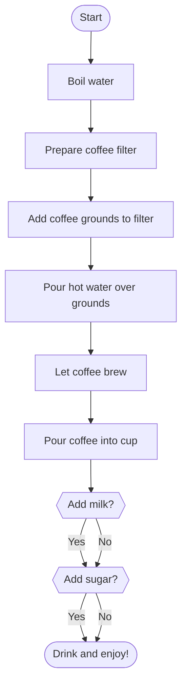

```mermaid
flowchart TD
    Start([Start])
    Boil[Boil water]
    Filter[Prepare coffee filter]
    AddCoffee[Add coffee grounds to filter]
    Pour[Pour hot water over grounds]
    Brew[Let coffee brew]
    PourCup[Pour coffee into cup]
    AddMilk{{Add milk?}}
    AddSugar{{Add sugar?}}
    Drink([Drink and enjoy!])

    Start --> Boil --> Filter --> AddCoffee --> Pour --> Brew --> PourCup
    PourCup --> AddMilk
    AddMilk -- Yes --> AddSugar
    AddMilk -- No --> AddSugar
    AddSugar -- Yes --> Drink
    AddSugar -- No --> Drink
```
