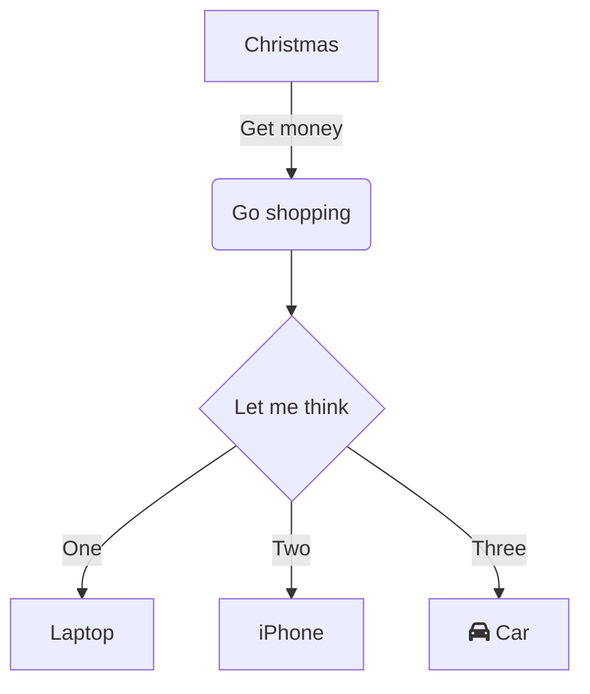

 

## Roadmap 
- [ ] Базовая функциональность
- [x] НЕИНТРЕСНО СИРИНА ИДИ ДОМОЙ
- [ ] Тесты
- [ ] 📱 Мобильная версия
- [ ] 🌐 Интернационализация
- [ ] 🚧 Документация API - [ ]
  [ ]  - [ ] 

 
❓ FAQ
 
 
Как установить?
   Выполните <code>npm install</code> 

    

 

