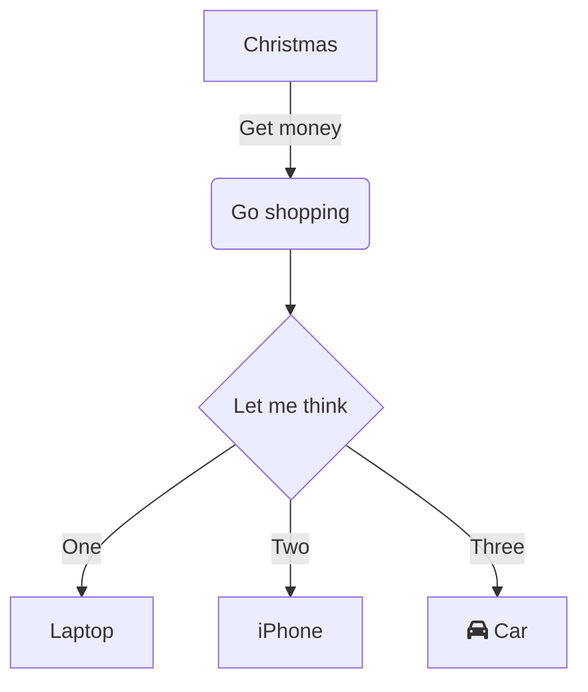

[![forthebadge]data:image/svg+xml;base64,PHN2ZyB4bWxucz0iaHR0cDovL3d3dy53My5vcmcvMjAwMC9zdmciIHdpZHRoPSIxMzUuMzEyNTE5MDczNDg2MzMiIGhlaWdodD0iMzUiIHZpZXdCb3g9IjAgMCAxMzUuMzEyNTE5MDczNDg2MzMgMzUiPjxyZWN0IHdpZHRoPSI3MS4zMjI5MjU1Njc2MjY5NSIgaGVpZ2h0PSIzNSIgZmlsbD0iIzYwYTcxMSIvPjxyZWN0IHg9IjcxLjMyMjkyNTU2NzYyNjk1IiB3aWR0aD0iNjMuOTg5NTkzNTA1ODU5Mzc1IiBoZWlnaHQ9IjM1IiBmaWxsPSIjNWM1NjBkIi8+PHRleHQgeD0iMzUuNjYxNDYyNzgzODEzNDgiIHk9IjIxLjUiIGZvbnQtc2l6ZT0iMTIiIGZvbnQtZmFtaWx5PSInUm9ib3RvJywgc2Fucy1zZXJpZiIgZmlsbD0iI0ZGRkZGRiIgdGV4dC1hbmNob3I9Im1pZGRsZSIgbGV0dGVyLXNwYWNpbmc9IjIiPlNVUEVSPC90ZXh0Pjx0ZXh0IHg9IjEwMy4zMTc3MjIzMjA1NTY2NCIgeT0iMjEuNSIgZm9udC1zaXplPSIxMiIgZm9udC1mYW1pbHk9IidNb250c2VycmF0Jywgc2Fucy1zZXJpZiIgZmlsbD0iI2RmMTAxMCIgdGV4dC1hbmNob3I9Im1pZGRsZSIgZm9udC13ZWlnaHQ9IjkwMCIgbGV0dGVyLXNwYWNpbmc9IjIiPkVBU1k8L3RleHQ+PC9zdmc+)](https://forthebadge.com)

## Roadmap 
- [ ] Базовая функциональность
- [x] НЕИНТРЕСНО СИРИНА ИДИ ДОМОЙ
- [ ] Тесты
- [ ] 📱 Мобильная версия
- [ ] 🌐 Интернационализация
- [ ] 🚧 Документация API - [ ]
  [ ]  - [ ] 

 
❓ FAQ
 
 
Как установить?
   Выполните <code>npm install</code> 

    

 

